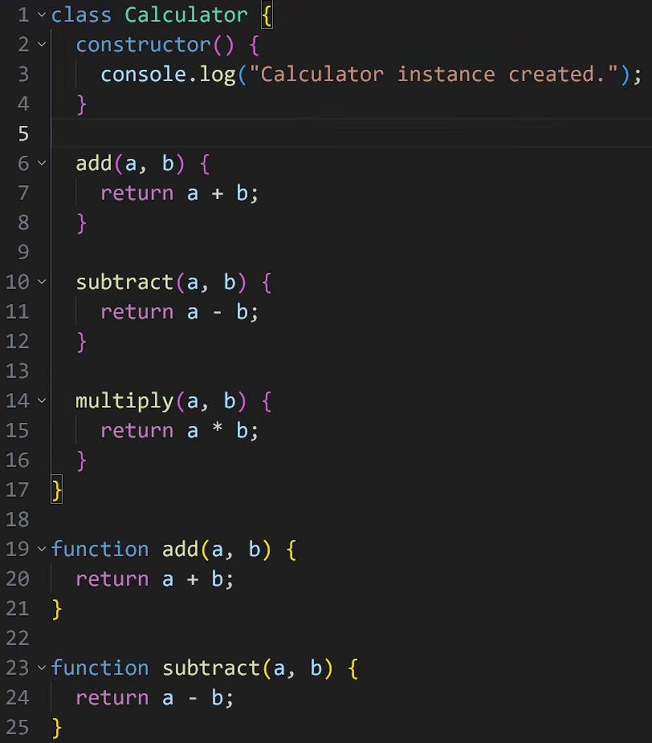

# Next Previous Method
This extension provides shortcut for `Next Method` and `Preview Method` navigation like Visual Studio. This will help you quickly move back and forth through the method.

# Features
- Ctrl+Up: Next Method
- Ctrl+Down: Previous Method

# Notice
This extension relies on the support extension for each language.
Not working without the language extension activated.
